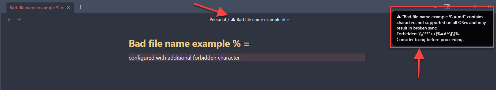

# Cross-OS Name Guard

⚔️ **Protect your notes from file naming conflicts across operating systems and prevent sync issues!**

---

## ⚡ Features

✅ Warns you when file or folder names contain characters that can break sync on Windows, macOS, Linux, or Android.  
✅ Adds a ⚠️ icon in the title bar of affected files.  
✅ Shows a clear notice listing forbidden characters.  
✅ Customizable additional forbidden characters (via plugin settings).

---

### 📷 Screenshot



---

## 🚀 How to use

### 🌟 Install from Community Plugins (recommended)

1. In Obsidian, go to **Settings → Community plugins → Browse**.
2. Search for **Cross-OS Name Guard**.
3. Click **Install**, then enable it from the Installed plugins list.

---

### 💻 Manual installation (advanced)

1. Download the latest [release zip](https://github.com/yourusername/cross-os-name-guard/releases).
2. Extract the contents (should include `main.js`, `manifest.json`, and optionally `styles.css`) into your vault's plugin folder:

    - On desktop: `.obsidian/plugins/cross-os-name-guard/`
    - On mobile: `Obsidian/plugins/cross-os-name-guard/`

3. Restart Obsidian or reload plugins, then enable it in **Settings → Community plugins → Installed plugins**.

---

## ⚙️ Configuration

- Open **Settings → Cross-OS Name Guard**.
- Optionally add extra forbidden characters to customize validation.

---

## 🔒 Default forbidden characters

```
\ / : * ? " < > | % # ^ [ ]
```

You can add your own additional characters in the plugin settings.

---

## 💬 Support

Suggestions or issues? [Open an issue on GitHub](https://github.com/yourusername/cross-os-name-guard/issues).

---

## 🪪 License

MIT License. Free to use and modify.

---

## ☕ Support my work

If you find this plugin helpful, you can support me here:

[](https://coff.ee/zameerfouzan)

---
